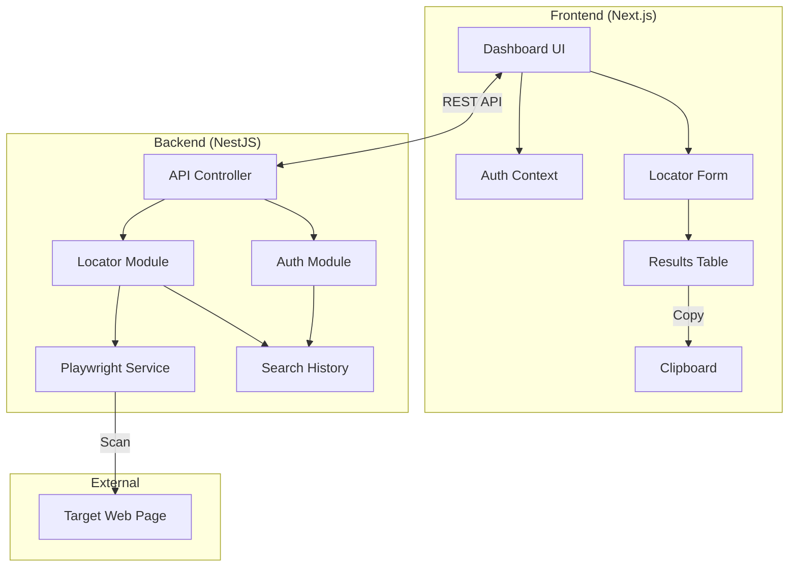

# QA Locator Tool Architecture Diagram

### Flow Description
1. **Authentication**: User logs in/signs up via the `Auth Module`.
2. **Request**: User enters a URL and keyword in the `Locator Form`.
3. **Processing**: `Locator Module` triggers `Playwright Service`.
4. **Automation**: Playwright opens the `Target Web Page`, scans for the keyword, and generates exact locators (XPath/CSS/ID).
5. **Display**: Results are returned to the `Dashboard` and shown in the `Results Table`.
6. **History**: Each search is logged in the `SQLite Database` for later retrieval.
